# FAST MEAL SERVICE API
## By John Lavender

---

### WHAT IS THIS PROJECT?

This project was written in the span of two days (over the weekend of October 22, 2022, as part of the 
application process for an internship at a particular company. This is a simple API project with a mock database table
and a command-line gui app. 

---

### TASK REQUIREMENTS  

    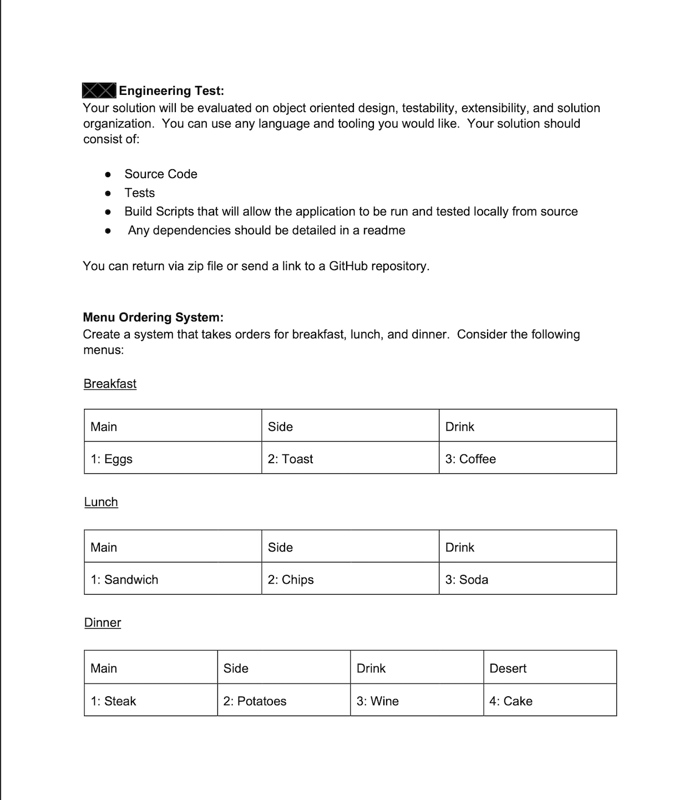

    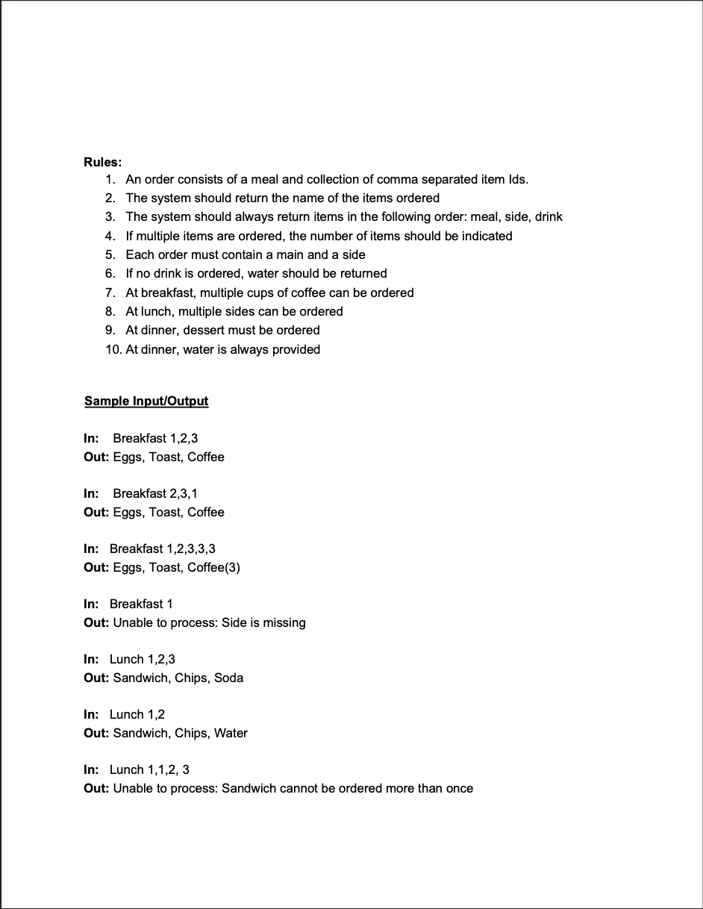

    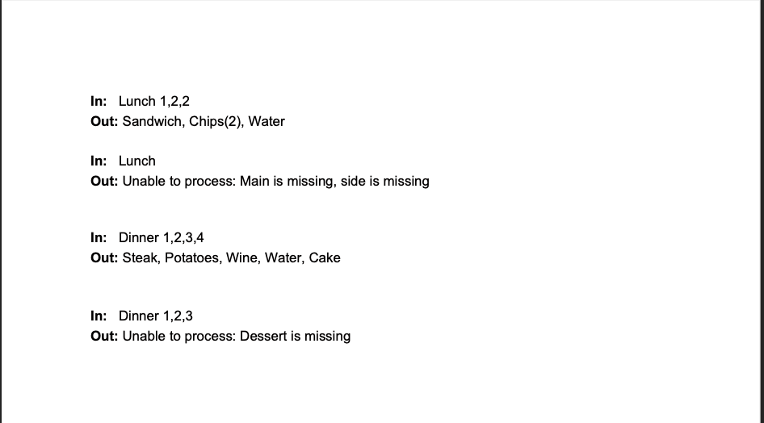

---

### MY APPROACH

I decided to treat these requirements like those of an API service. I have 
some experience working with Spring Boot and so designed the directory structure
reminiscent of that found in a lot of Spring Boot apps.

- src
  - main
    - api
      - db
      - domain
      - exceptions
      - factories
      - services
      - utils
    - tests
    - utils
    - App.java [main class]

(For the sake of brevity, App.java, which is the main class, is the only Java class listed)

The main class in this structure is not integral to the API functioning. The core class that 
is exposed to callers is MealService.java. This is the class that App.java uses to interact 
with the API. App.java is merely a UI shell.

---

### RUNNING THE PROGRAM

#### REQUIREMENTS:

- JRE (Java Runtime Environment) version 8 or higher 
  - Project tested with Java 8, should run the same on newer versions
- Terminal (MacOS, Linux), Powershell (Windows), or similar command line application

#### INSTRUCTIONS:

<ol>
    <li>Download either the JAR file by itself or the .zip file for the entire repository</li>
    <li>Navigate using a command line app to the directory containing the JAR file</li>
    <li> 
        There are two options for running the jar
        <ol>
            <li>
                Enter "java -jar Fast-Meal-Service-API.jar test" to run the test suite
                <ul>
                    <li>This will run the test method(s) contained in tests/Tests.java</li> 
                    <li>These are the same tests as those listed out in the "Task Requirements" documentation above</li>
                    <li>Each test will print output including a "PASS" or "FAIL" statement</li>
                    <li>Once all the tests have run, the program will exit</li>
                </ul>
            </li>
            <li>
                
                    Enter "java -jar Fast-Meal-Service-API.jar" to run the normal program.
                    (Same command as the first but without the word "test" at the end)
                
                <ul>
                    <li>This will run the command-line gui app</li>
                    <li>Instructions for running the command-line gui app enumerated below</li>
                </ul>
            </li>
        </ol>
    </li>
</ol>

If for any reason you want to build from source instead of the running the jar, you can load this project into IntelliJ 
and create a run configuration for run the main method in App.java.

Alternatively, if for any reason you prefer or need to do so (such as inability to install JRE locally), you can look 
into running Java on Docker:
https://www.jetbrains.com/help/idea/running-a-java-app-in-a-container.html#run_java_app_in_container

#### OUTPUT FOR "java -jar Fast-Meal-Service-API.jar test"

    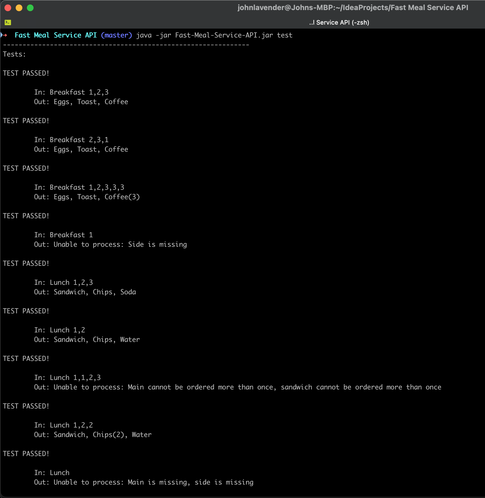

#### OUTPUT FOR "java -jar Fast-Meal-Service-API.jar"

    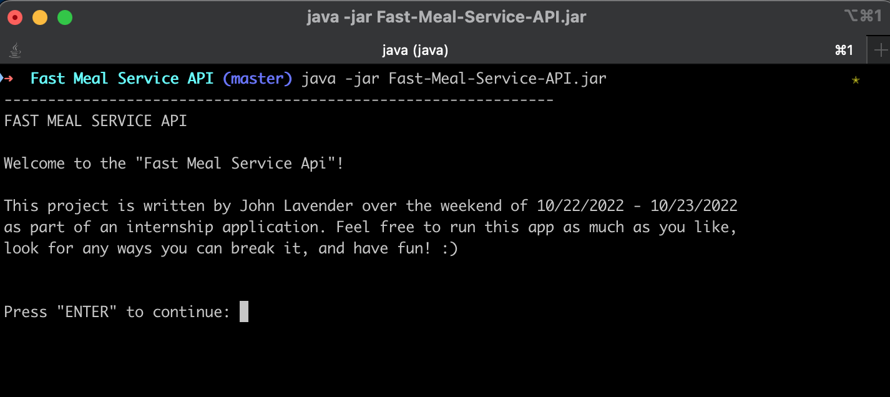

---

### RUNNING THE COMMAND-LINE GUI APP

1. You'll first be presented with options to handle ordering meals or else checkout.

    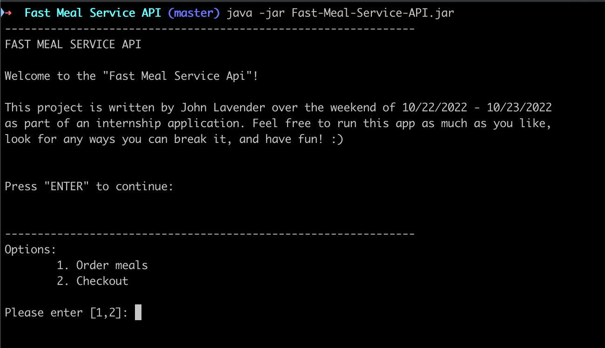

2. When you select the first option, you'll then be presented with these options.

    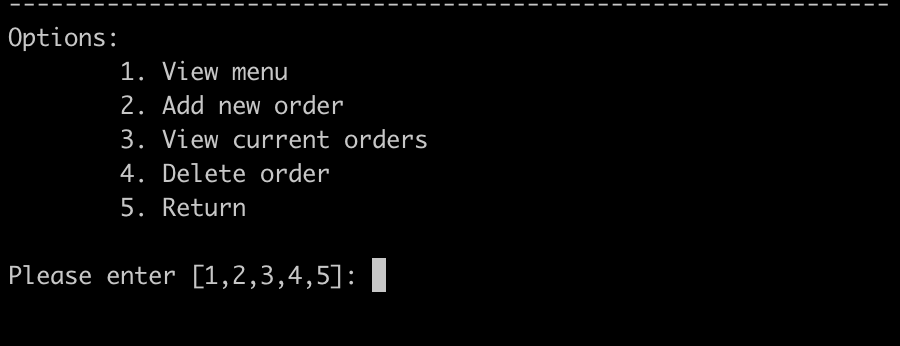

3. We'll select the first option which is to view meal menus and rules. You'll need to choose which meal type to view.

    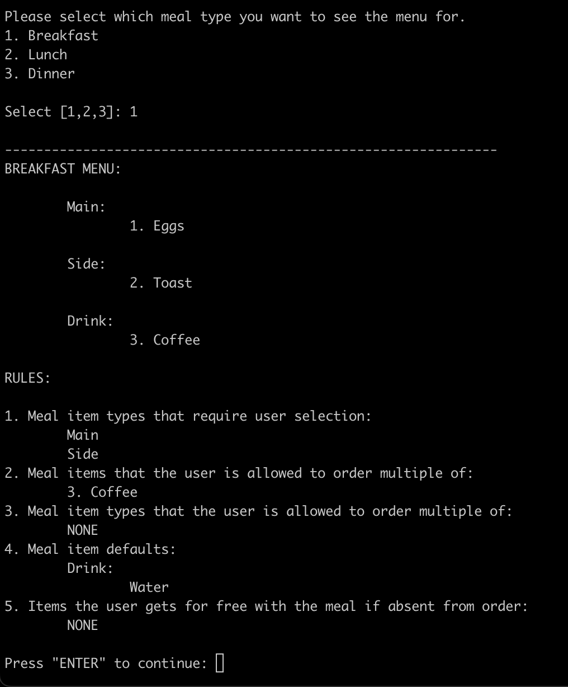

4. If you go back to the last menu now and choose to add a meal order, you'll see this.

    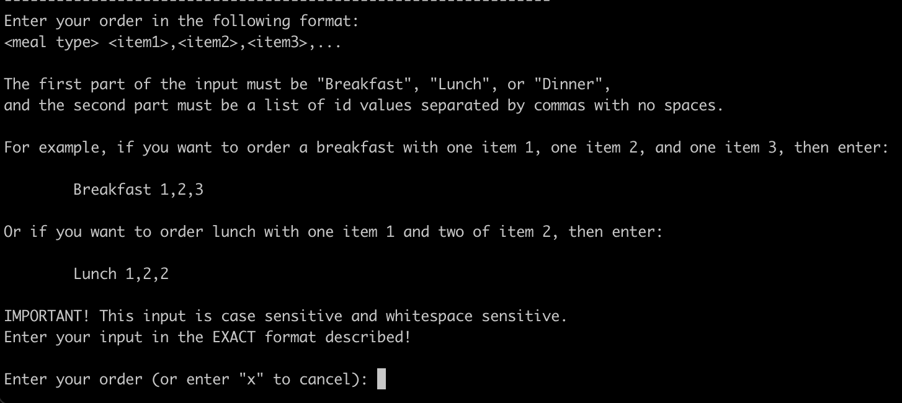

5. Let's enter "Breakfast 1,2,3".

    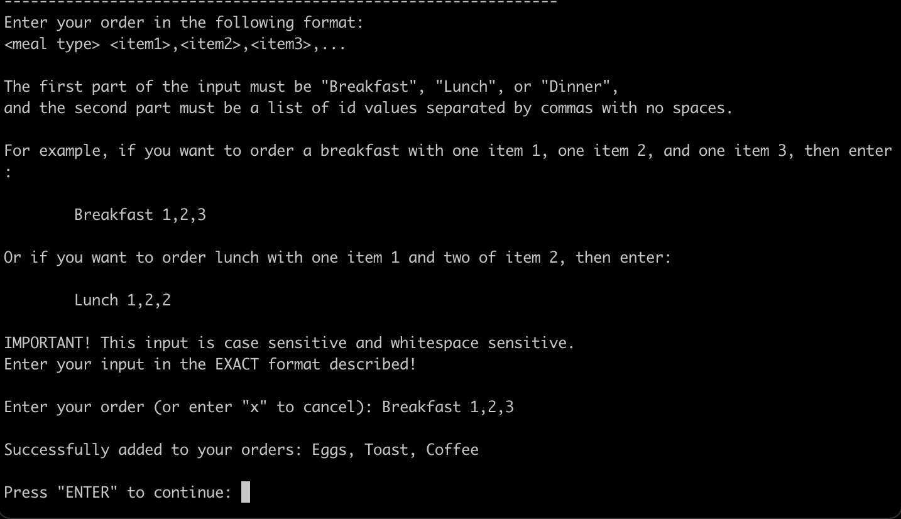

6. If you entered invalid output, you'll get an error message and a chance to try again.

    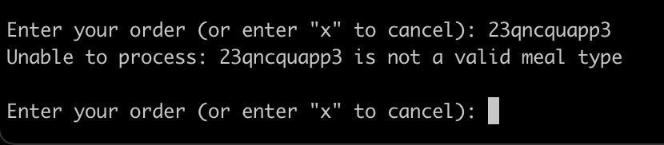

  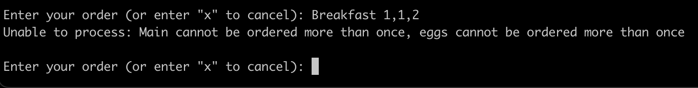

7. You can view your current orders.

  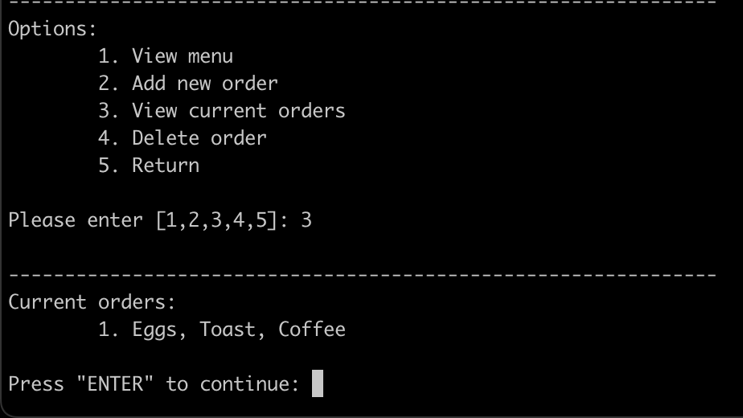

8. You can also choose to delete orders if desired. Select the index of the meal to delete. Invalid input is handled.

  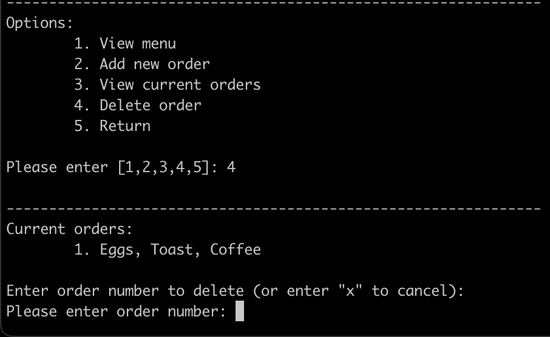

  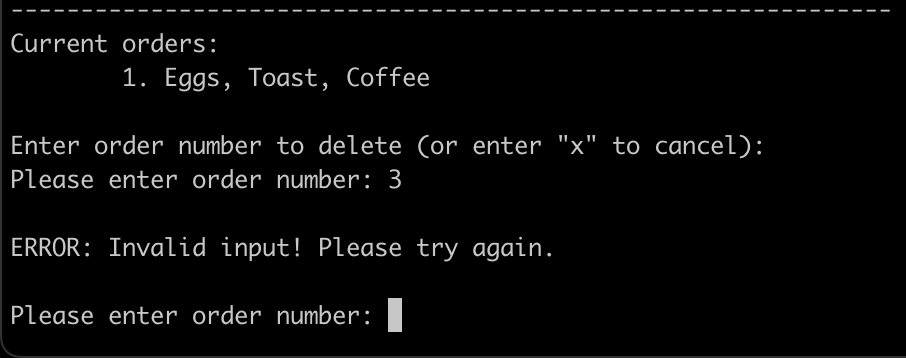

  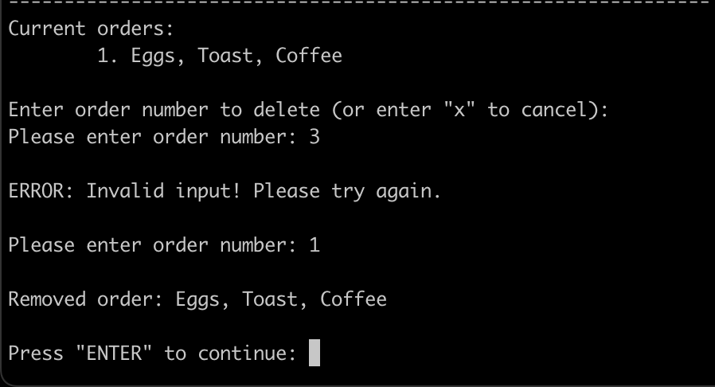

9. Lastly, back at the first menu, you can checkout (or exit) the app.

  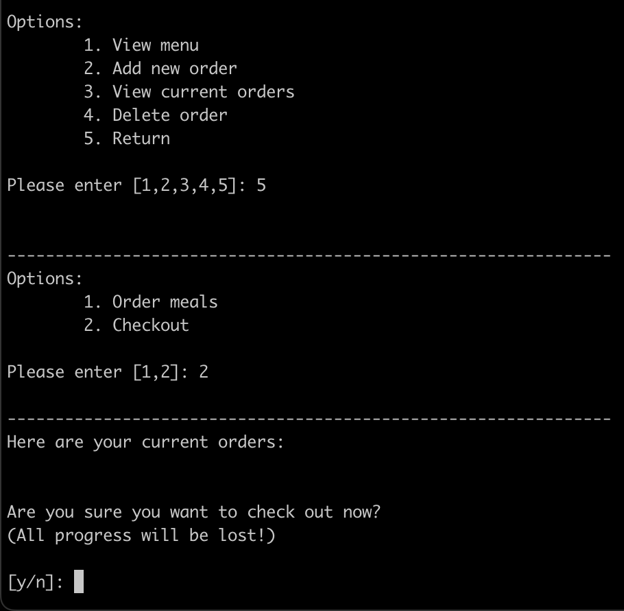

---

### THANK YOU FOR TAKING THE TIME TO LOOK OVER MY PROJECT. I HOPE YOU ENJOYED IT! 

